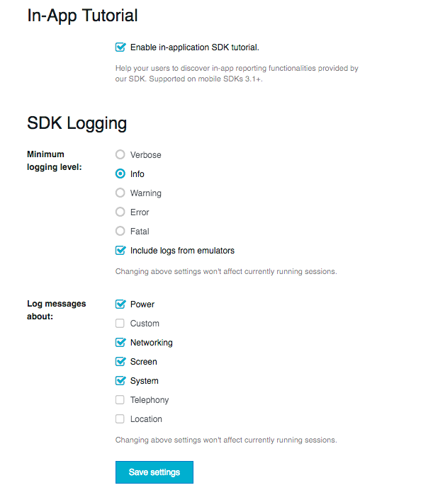
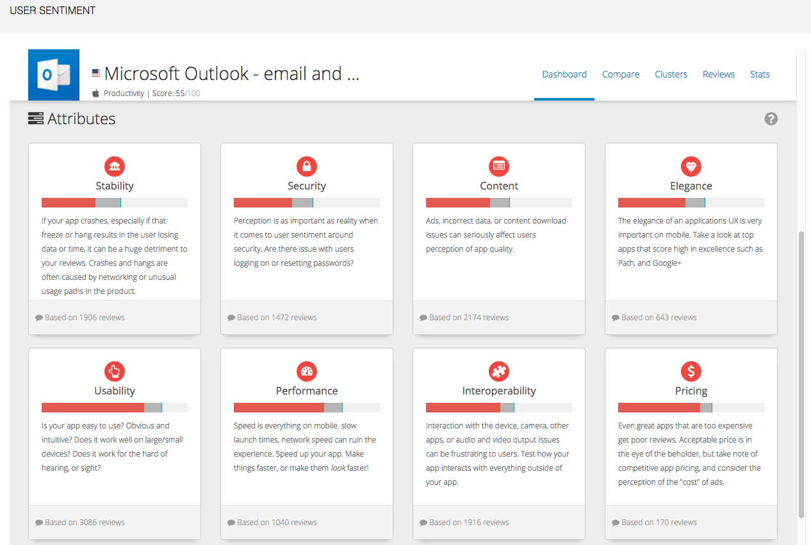

# IBM Bluemix demo - Mobile Quality Assurance (MQA)

In this lab, you will demonstrate one key feature of the Mobile Quality Assurance service in Bluemix - Sentiment Analysis of user feedback posted on the public iTunes app store.  

---
## Prework

Make sure all these items are completed and working **before** you head into the demo.  Also (and this goes without saying) make sure there is a working Internet connection available in the demo location.  It's pretty much impossible to demo the Cloud without access to the internet...

### Create a Bluemix account
___

1. Open a browser and visit http://www.bluemix.net

1. Press the SIGN UP button
 	
	

1. Complete the form and press the CREATE ACCOUNT button
	
	

1. Check your email for your next steps.
	
	

1. Open the email and click the Confirm your account link
	
	

1. Once confirmed, you will be taken to a page that says Success! To login, click the Log In link
	
	

1. Enter your email address and press the CONTINUE button

1. Then enter your password on the next page and press the LOG IN button

1. You will be prompted to create an organization. Enter an organization name (notice that there are suggestions for you). This can be anything, but is typically an email address, since that can be guaranteed to be unique within Bluemix.  Make sure **US South** is selected as the region. Press the CREATE button to continue.
	
	

1. Next you will be prompted to create a space such as dev, demo, test, prod, etc. You can name it whatever you would like (again notice the recommendations). Then press the CREATE button.
	
	

1. Next you will see the Summary page where you can review your entries. Press the I'm Ready button
	
	

1. Once you see the following screen, your account has been created and configured.
 	
	

## Performing the Demo

1. Logon to your Bluemix account.  

1. The Mobile Quality Assurance tile is located in the **Mobile** category.  You can find it by navigating with the side-bar menus (click the Mobile category), or you can start typing **mobile quality** in the search field as shown below.

	

1. Click the Mobile Quality Assurance tile to open its properties page. The service name is provided for you, and there's no need to change it.   

	Here you can talk to the features that that are in MQA but will NOT be demonstrated.  They are:
	* Mobile Beta Management and Over-the-Air Distribution:  As mobile projects are in the development & test phase, it's important to get updated builds into the hands of testers very quickly.  MQA can function as a mini-app store for distributing these early builds to testers without having to post them onto the public App Stores, or physically tether the devices.
	* In-app Bug/Feedback Reporting:  With just a few lines of code, developers can instrument a mobile app with an entire feedback reporting mechanism. This allows testers and end users to provide feedback and submit enhancement requests right from within the mobile app itself. This includes the capability of capturing and annotating screen shots and full-motion video, along with textual descriptions of the bug or enhancement request. 
	* Automated crash reporting:  When mobile apps crash, all of the contextual data about the physical state of the device at the time of the crash is lost.  MQA can capture that information, such as battery life, OS patch level, Wi-Fi or mobile data signal strength, etc., and report that back to the development team automatically.
	* Bug Tracking System integration:  The bug reports, crash logs, and enhancement requests can be integrated with many popular bug tracking software packages, such as Jira, Bugzilla, and Rational ClearQuest.

	
	
1. Scroll lower on the page to show the two different pricing options:
	* Standard Plan:  $199 per mobile application, plus $.02 per addressable device with the first 100 devices free.  Great for small distributions or a single application.
	* Premium Plan: $3000 per mobile application, with unlimited number of users/devices.

	
	
1. Click on the big blue **CREATE** button at the bottom of the page to provision the MQA instance.  You should see the following screen, with the green dot labeled **Service Available**.  The two buttons on the right `Getting Started` and `Download SDKs` are links to the Developer Center.  The SDKs are available for the following mobile platforms:
	* Native iOS and Android
	* A Cordova plugin for hybrid mobile apps
 	* Javascript (for non-Cordova HTML5 apps)

	
	
1. Click the black button labeled **Add MQA App**.  That will expand the current screen, where you can fill out the Application Name and choose a mobile platform.  Even though we won't be building a mobile app in this demo, we still need to provide a name.  We'll be doing Sentiment Analysis against popular mobile calendar apps, so let's call the application "Outlook". Type that in the Name field, and click the **iOS** image. (You'll notice that the border of the iOS text gets a little bolder when it's selected.)  Then click the **Submit** button.
 
	

1. Next, you'll see the following image.  To enable Sentiment Analysis, click the hyperlink near the bottom of the screen that says **Configure Sentiment Analysis**.

	

1. 	That opens a new page in the browser, and loads the MQA Application Settings page. If we were going to build a mobile app and instrument it with the MQA feedback software, the *APP Key** is the link back to Bluemix so that it knows where to store the collected feedback.  The only thing we have to do on this page is click the **Active User Sentiment integration** checkbox.

	

1. As soon as that checkbox gets turned on, a new section of the screen will appear. A dropdown list is populated with public app store apps whose name or category matches the name you've given the MQA app (in this case, "Outlook".)  There is also a dropdown where you can select the App Stores from other countries, but let's leave this as **US**.
 
	

1. Select **Microsoft Outlook - email and calendar**, then scroll all the way to the bottom and click the **Save Settings** button. Again, all the other settings here (In-App Tutorial, SDK Logging levels...) are only pertinent when we're instrumenting a custom mobile app with MQA. We can ignore these for this demo. 

	

1. Click the **User Sentiment** link near the bottom of the menu panel on the left side. 

	

1. You're now in the User Sentiment analysis dashboard.  The data that is being analyzed here comes from the Reviews posted on the public app stores for the selected app.  The reviews are grouped into clusters by rating level and assigned a color based on sentiment. You can change the date period, or look for positive or negative reviews only. And the data can be exported to CSV format for analysis in external tools like Excel.

	

1. Scroll down farther to see the reviews broken out and assigned into ten Attribute categories.  For each category, the red line shows the current app's rating and the gray bar represents the industry averages for that category.

	
	
1. You can click on any of the Attributes to drill down into the Reviews detail data.  This is an interactive screen. You can click the checkboxes next to any of the Attributes to add them to the analysis. You can change the dates, or include/exclude Star rating levels.  The graph at the top reflects positive or negative reviews posted over the date range, and changes dynamically to reflect the selected data.

	

1. Click the Compare link at the top of the screen (between **Dashboard** and **Clusters**).  This uses a Spider graph to graphically depict the sentiment across the different Attributes.  It starts with just the Outlook app loaded (the blue line), and it compares that to the industry averages in the sector (the black line). 

	

1. Find other calendar apps to compare with Outlook.  In the Search box, enter the word "calendar". A list will be populated with other calendar apps from the App Store.  Select **Google Calendar** and **Tiny Calendar**.  Their data will be superimposed onto the spider graph, to easily visualize how they compare to Outlook.  This can be an important guide for Product Management, to assess the weaknesses in their mobile app vs. their main competition.

	

[important]: https://github.com/ibm-apiconnect/pot-onprem-docs/raw/5010/lab-guide/img/common/important.png "Important!"
[info]: https://github.com/ibm-apiconnect/pot-onprem-docs/raw/5010/lab-guide/img/common/info.png "Information"
[troubleshooting]: https://github.com/ibm-apiconnect/pot-onprem-docs/raw/5010/lab-guide/img/common/troubleshooting.png "Troubleshooting"