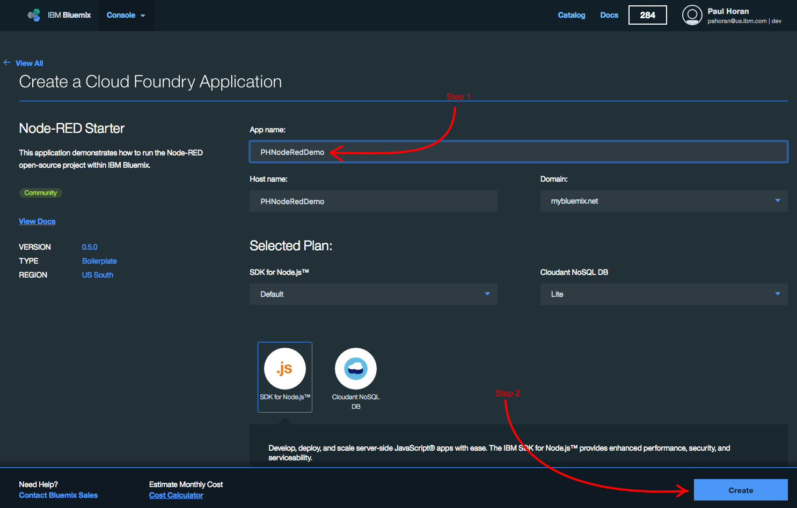

# IBM Bluemix demo - NodeRed

In this lab, you will demonstrate several Bluemix capabilities - including the NodeJS runtime, Watson sentiment analysis, Social Media integration via Twitter, the NodeRed graphical editor for building NodeJS programs, and the Cloudant noSQL database.

---
## Prework

Make sure all these items are completed and working **before** you head into the demo.  Also (and this goes without saying) make sure there is a working Internet connection available in the demo location.  It's pretty much impossible to demo the Cloud without access to the internet...

###  Create a Twitter account

If you already have one, you can skip this step.  If you don't, go to www.twitter.com and sign up. Remember your username and password, as you'll need them for the demo.

### Create a Bluemix account
___

1. Open a browser and visit http://www.bluemix.net

1. Press the SIGN UP button
 	
	

1. Complete the form and press the CREATE ACCOUNT button
	
	

1. Check your email for your next steps.
	
	

1. Open the email and click the Confirm your account link
	
	

1. Once confirmed, you will be taken to a page that says Success! To login, click the Log In link
	
	

1. Enter your email address and press the CONTINUE button

1. Then enter your password on the next page and press the LOG IN button

1. You will be prompted to create an organization. Enter an organization name (notice that there are suggestions for you). This can be anything, but is typically an email address, since that can be guaranteed to be unique within Bluemix.  Make sure **US South** is selected as the region. Press the CREATE button to continue.
	
	

1. Next you will be prompted to create a space such as dev, demo, test, prod, etc. You can name it whatever you would like (again notice the recommendations). Then press the CREATE button.
	
	

1. Next you will see the Summary page where you can review your entries. Press the I'm Ready button
	
	

1. Once you see the following screen, your account has been created and configured.
 	
	

### Provision the Node-RED Starter boilerplate

1. Logon to your Bluemix account.  

1. In the catalog, navigate to the **Boilerplates** section, and click on the Node-RED Starter tile.

	

1. Give the Node-RED application a name. The name you provide will be concatenated with the domain name `bluemix.net` to create a URL, so it must be unique across the entire internet. Choose wisely...  Click the CREATE button to provision the service.

	
	
1. After a few seconds, you will see the notification that your Node-RED app has started.

	
	
1. To verify that the service is up and that the URL is available, make sure that the Status is showing a green dot, with the text *Your app is running*. Refresh the screen every few seconds until that changes.  It should take less than a minute.  Once that appears, click the button labeled **View App**.  

	
	
1. That will open your default browser, and load the URL `https://<your app name>/mybluemix.net`.  It would be wise at this stage to bookmark this page in the browser, as you'll be returning here during the demo.
 
	
	
### (Optional) Preload the Twitter Sentiment analysis app

This is a step that you can certainly do live in front of the customer, but when time is short it's good to have this up and ready to go.

1.	Click the red button labeled "Go to your Node-RED flow editor".  This launches a browser, and loads a blank Node-RED workflow screen.  

	
	
1. Open this link:  https://github.com/pahoran/Node-RED/blob/master/Twitter-flow.  It contains the source code for a complex Node-RED flow.

1. Highlight the entire contents of the file, top-to-bottom, and copy it to the clipboard (Ctrl-C, or right-click Copy).

	

1. Back in the Node-RED editor, click the "hamburger" menu in the upper right-hand corner, and select `Import > Clipboard` 

	

1.  That opens the **Import Nodes** dialog. Paste the clipboard contents in the big box in the middle, then click the red `Import` button to create the flow:
	
	

	You should now see this screen.  Click your mouse once to anchor the Flow to the canvas.
		
	
	
1. Double-click the blue `Get Tweets` node to open its Properties dialog.  

	

	* Click the "pen" icon next to the "Add new twitter-credentials" field.  This will take you through a set of screens that will authorize Node-RED to access your Twitter account. Approve this access and return to the `Get Tweets` properties dialog. 
	
	* Set the `Search` field to `All Public Tweets`.

	* The `for` search criteria field will default to "Trump, Clinton".  Change that to anything you want to search for.  Separate any distinct search values with commas.  

	* Click `Done` to return to the flow panel.

	* Click the red `Deploy` button in the upper right-hand corner to deploy the revised flow into Bluemix.

	* Select the `Debug` tabpage to see the tweets flowing past.  This is an indication that the app is working properly. If you don't see Tweets here, your search phrase might not be bring back any data. 

	* Open a new browser window, and navigate to `http://<your Node-RED app>.mybluemix.net/map`.  Bookmark this URL for easy access during the demo.  You should see the map with tweet pins appearing dynamically.

	> ![][important]
	> 
	> The Developer version of the Twitter API is limited to a set number of API calls per minute.  If you leave the app running in the background it will quickly reach its threshold, and stop delivering tweets.  For a truly effective demo, don't start the Node-RED application in Bluemix until you're ready to show the map.  You'll typically have about 15 minutes, depending on the popularity of the search phrase used.
	
	* In the browser, go back to the Bluemix console and stop the Node-RED application. Go to the Console and find the row for the Node-RED application you created.  On that row, select the icon that looks like three vertical dots.  Choose `Stop App` from that menu to stop the Node-RED app.  When it's time to actually deliver the demo, you'll return to this screen, select the same three-dot icon, and choose `Start App`.

	

 
## Delivering the Demo

### Before you enter the room

1. Ensure you have an internet connection. If there's no "guest" Wi-Fi, test the connectivity from your phone's hotspot.  If you're delivering the demo from inside a secure bunker, the chances of getting a reliable connection are slim, and you should gracefully eject now.

2. Open the Bluemix console, and login with your credentials.  Ensure you're getting good response time across your wi-fi connection. 

### Start the Show

####  Initial presentation 

    Slideware, if any, goes here.

####  Demonstration

1. Show the Bluemix console.  Spend as much time as you think is necessary to discuss the various service offerings in the catalog, but eventually land on the **Boilerplates** category.  

	
	
	Script:
	
	> Boilerplates are pre-configured groupings of services that give developers a head-start on any project, whether that's a Java web project, an IoT project, or a Mobile project. There's even a boilerplate for Microsoft's stack and ASP.NET development.  Let's take a look at one boilerplate in particular, IBM's Node-RED starter.  

1. Click on the Node-RED Starter tile, and bring up that screen.

	

	Script:

	> The Node-RED Starter boilerplate actually consists of two separate services that have been pre-integrated so that they work together seamlessly. The first is a nodeJS service, which is a highly scalable open-source runtime platform for Javascript applications. The second is the Cloudant NoSQL database service, which provides persistent storage and retrieval of JSON documents.  Node-RED is the open source graphical editor for wiring together APIs and services into a web or IoT application. 
	> IBM is a huge proponent of Open Source, and currently has two Board seats on the NodeJS Foundation. IBM is the only vendor that can offer support plans for open source software such as nodeJS.
	> All I need to do to create this platform is give the service a unique name, and click the **Create** button.  That will spin up a new nodeJS runtime server instance, and add the NodeRED application, and publish the public URLs out to the web. Since Bluemix uses  consumption-based pricing, I'll only be charged for the compute cycles I actually use. There's a handy Pricing Calculator link at the bottom of the screen that can be used to estimate monthly charges.
	> In the interest of time, I've already got that service set up. Let me start that running now.

1. Do NOT click the **Create** button now.  Instead, click the **Console** button near the top-left of the screen.  That drops down a graphical menu, as shown below.

	
	
	Click the **Compute** button.  That takes you to a window that shows the Node-RED service that you created during the pre-work section.  At this point, its status should be **Stopped**.  Click the icon at the right-hand side that looks like three vertical dots, and select **Start App**. This should only take about 10-20 seconds. Explain that Bluemix is spinning up the NodeJS server instance, and publishing the unique URL.

	
	
1. 	When the app is finally running, click the blue URL link in the **Route** column.

	
	
1. This loads the main Node-RED landing page.  Just click the big red button labeled **Go to your Node-RED flow editor**.  This will load the Node-RED editor into the browser screen.  It should also have loaded the complex flow that was imported in the pre-work.

	

	Script:

	> We're now looking at the Node-RED flow editor, a graphical drag-and-drop programming environment for the creation of web-based apps, internet-of-things apps, and APIs.
	> Down the left-hand side is the palette of nodes that represent the different inputs, outputs, and processing options available to be wired together.  Inputs can be standard HTTP calls, serial port and IOT devices, or messages from an MQ bus.  There are a number of possible outputs as well, including HTTP responses, SMS text messages, and even push notifications to smart phones. 

1. Start scrolling down through the palette. 

	Script: 

	> There are different flow of control and processing functions available.  Social network integration, including email and Twitter. A number of different databases are represented here in the Storage section. Scrolling down farther, we get into the really interesting functions - the Watson cognitive APIs. These are now available to you through this simple drag-and-drop programming interface. And the open source community is contributing new APIs and nodes on a regular basis. 
	
	> Let's look at the complex flow we've got here as the sample app.
	
	*Point to the light blue node "Get Tweets"*
	
	> This starts by retrieving tweets from the public Twitter stream, searching for a specific phrase. Right now, we're searching for tweets containing either "Clinton" or "Trump", but we can change that to anything.
	
	At this point, you could click the Get Tweets node, and change the phrase to anything.  "Zika", "Climate Change", "World Series"...  If you do make a change here, you must click the red **Deploy** button in the upper right-hand corner to push that change up to Bluemix.
	
	*Point to the light purple node labeled "sentiment".*
	
	> It then passes them into the Watson sentiment analysis API, and assigns either a positive, negative, or neutral "sentiment" score. 
	
	*Point to the dark blue node labeled "Tweet DB".* 
	
	> This data is then persisted into the Cloudant database that was provisioned as part of the boilerplate.  
	
	*Point to the node labeled [get] /map at the bottom*
	
	> Down here at the bottom we've defined an HTTP request endpoint named "map", and this is where we'll retrieve tweet data from the Cloudant database and plot it on a map.  Let's see that in action.
	
1. Now open the link for the map. If you bookmarked it during the pre-work, just open that bookmark.  If not, it should be http://yourNodeRedapp.mybluemix.net/map.

	
	
1. Click on various green pins and red pins to pull up the underlying tweet data. This shows that the sentiment analysis is working.	

	> ![troubleshooting]  The /map URL is just "http" - it's not "https".  If you get that wrong, the map will start to render, but no tweets will show up.
	  
#### End of DEMO

### Shutting Down

It's important to STOP your Node-RED service, or it will continue running and accumulating charges.  If it's not convenient to do this during or after the meeting, make sure you get to it at your next opportunity.

1. Go back into the Bluemix console screen. It should show your Node-RED service as **Running**.

2. Click the three vertical dots on the left, and choose **Stop App**.

[important]: https://github.com/ibm-apiconnect/pot-onprem-docs/raw/5010/lab-guide/img/common/important.png "Important!"
[info]: https://github.com/ibm-apiconnect/pot-onprem-docs/raw/5010/lab-guide/img/common/info.png "Information"
[troubleshooting]: https://github.com/ibm-apiconnect/pot-onprem-docs/raw/5010/lab-guide/img/common/troubleshooting.png "Troubleshooting"